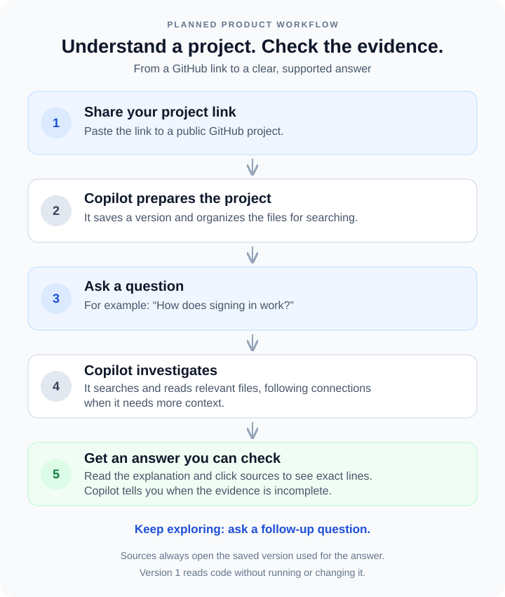

# GitHub_Copilot
AI developer assistant that can ingest a repository, understand its structure, answer codebase questions with file/line citations, trace flows across files, and eventually analyze proposed changes.

The product combines code-aware hybrid retrieval, deterministic repository tools, and a single tool-using agent. Answers are grounded in an immutable repository snapshot and include clickable, validated source citations.

## How it will work

## First success criterion

Given a public GitHub repository URL and a pinned commit, answer “Where is authentication implemented?” with supporting file and line citations—or explain when the inspected evidence is insufficient to establish an authentication implementation.

## Implementation plan

See [the step-by-step implementation plan](docs/implementation-plan.md) for the agreed architecture, data model, delivery phases, acceptance criteria, and advanced roadmap.

The first delivery is a Python command-line prototype with exact and semantic retrieval and a small evaluation dataset. The second adds background indexing, FastAPI, a bounded repository agent, and a Next.js workspace. Python repository parsing comes first; JavaScript and TypeScript support follows before the workspace release.

## Planned stack

| Layer | Technology |
| --- | --- |
| Frontend | Next.js, TypeScript, Tailwind, shadcn/ui |
| API and worker | Python, FastAPI, native Git CLI |
| Parsing | Python AST initially; Tree-sitter for JavaScript/TypeScript |
| Retrieval and storage | PostgreSQL with pgvector, exact code search |
| Agent | LangChain; custom LangGraph workflow when needed |
| Observability and evaluation | Structured local traces; optional LangSmith |
| Streaming and deployment | Server-Sent Events, Docker Compose |

## Scope

Version 1 supports public repositories, read-only investigation, repository trees, file viewing, hybrid search, cited Q&A, streaming, and conversation history. Repository code is never executed during ingestion or investigation.

Architecture explanations, flow tracing, and change-impact analysis follow once repository Q&A meets the evaluation gates. Code modification, private repositories, pull requests, and multi-agent workflows are outside version 1.

Status: design and implementation plan prepared; application implementation has not started.
